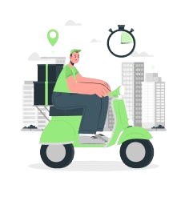
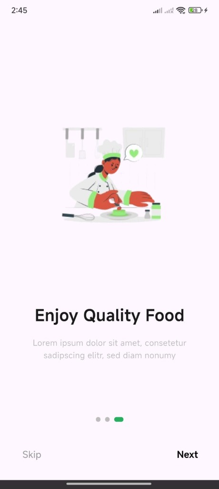
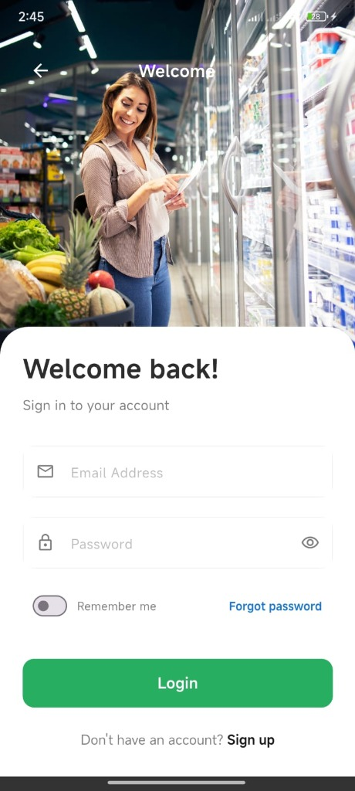
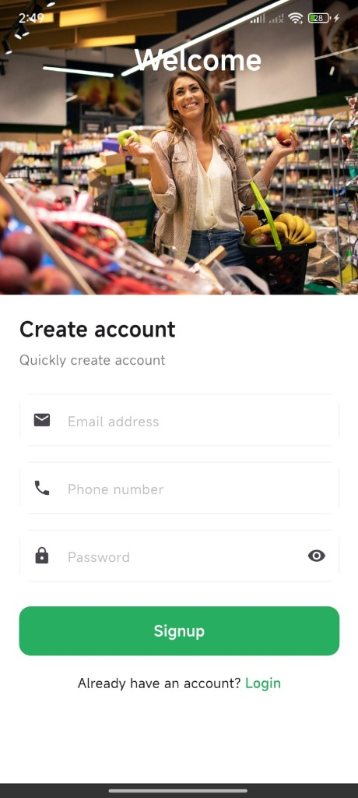
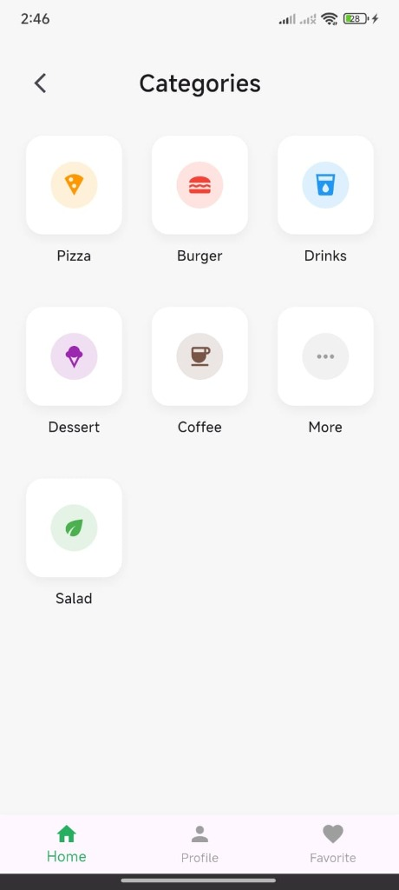
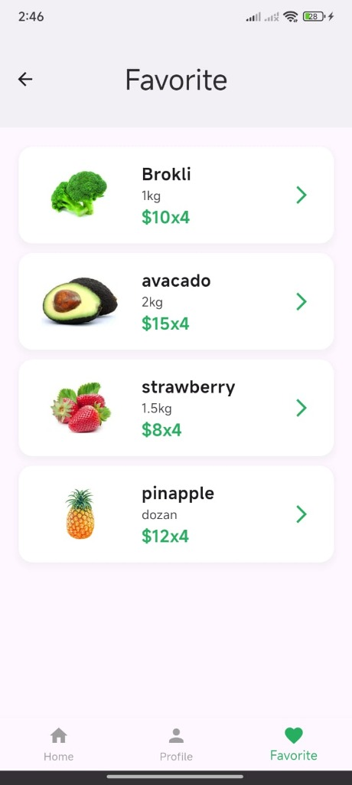

# 🛒 FreshGrocery - Premium Grocery App

FreshGrocery is a modern, high-performance Flutter application designed to provide a seamless grocery shopping experience. Built with **Clean Architecture** principles and a focus on **visual excellence**, this app features a premium user interface with smooth animations and responsive design.

---

## ✨ Features

- **🌟 Interactive Onboarding**: Multi-step splash screens with smooth page indicators to welcome users.
- **🔐 Secure Authentication**: Professional Login and Sign Up screens with real-time validation.
- **🏠 Intuitive Dashboard**: Category-based product organization for easy navigation.
- **👤 User Profile**: Dedicated profile management and favorite items tracking.
- **📱 Fully Responsive**: Optimized for various screen sizes using `flutter_screenutil`.
- **🎨 Premium UI/UX**: Custom-designed components with a modern color palette and typography.

---

## 📸 Screenshots & Demo

### 🚀 Onboarding Experience (Splash)
| Buy Grocery | Fast Delivery | Enjoy Quality Food |
| :---: | :---: | :---: |
|  |  |  |

### 🔐 Authentication
| Login Screen | Create Account |
| :---: | :---: |
|  |  |

### 🏠 App Content
| Categories | Profile | Favorite |
| :---: | :---: | :---: |
|  |  |  |

---


## 🛠 Tech Stack

- **Framework**: [Flutter](https://flutter.dev) (Dart)
- **State Management**: Clean separates presentation and business logic.
- **UI Enhancement**: 
  - `smooth_page_indicator`: For elegant onboarding.
  - `flutter_screenutil`: For adaptive UI sizing.
- **Architecture**: **Clean Architecture** (Data, Domain, Presentation) to ensure scalability and maintainability.
- **Design System**: Custom CSS-like theme implementation for colors and typography.

---

## 📂 Project Structure

```text
lib/
├── core/               # App-wide constants, themes, and utilities
├── features/           # Feature-based modular structure
│   ├── auth/           # Login, Signup, and Splash
│   ├── profile/        # Profile and Favorites
│   └── home/           # Product Catalog (Implementation in progress)
└── widgets/            # Reusable UI components
```

---

## 🚀 Getting Started

### Prerequisites

- [Flutter SDK](https://docs.flutter.dev/get-started/install) (v3.0.0 or higher)
- [Dart SDK](https://dart.dev/get-dart)
- An IDE (VS Code, Android Studio)

### Installation

1. **Clone the repository**:
   ```bash
   git clone https://github.com/muhamedxzidan/grocery_app_clean.git
   ```

2. **Navigate to project directory**:
   ```bash
   cd grocery_app_clean
   ```

3. **Install dependencies**:
   ```bash
   flutter pub get
   ```

4. **Run the app**:
   ```bash
   flutter run
   ```

---

## 🤝 Contribution

Contributions are what make the open source community such an amazing place to learn, inspire, and create. Any contributions you make are **greatly appreciated**.

1. Fork the Project
2. Create your Feature Branch (`git checkout -b feature/AmazingFeature`)
3. Commit your Changes (`git commit -m 'Add some AmazingFeature'`)
4. Push to the Branch (`git push origin feature/AmazingFeature`)
5. Open a Pull Request

---

## 📧 Contact

**Muhamed Zidan** - [GitHub](https://github.com/muhamedxzidan)

Project Link: [https://github.com/muhamedxzidan/grocery_app_clean](https://github.com/muhamedxzidan/grocery_app_clean)

---

Developed with ❤️ for a better shopping experience.
Team Flutter 132  ❤️ EraaSoft
Team Leader Gr C ❤️
